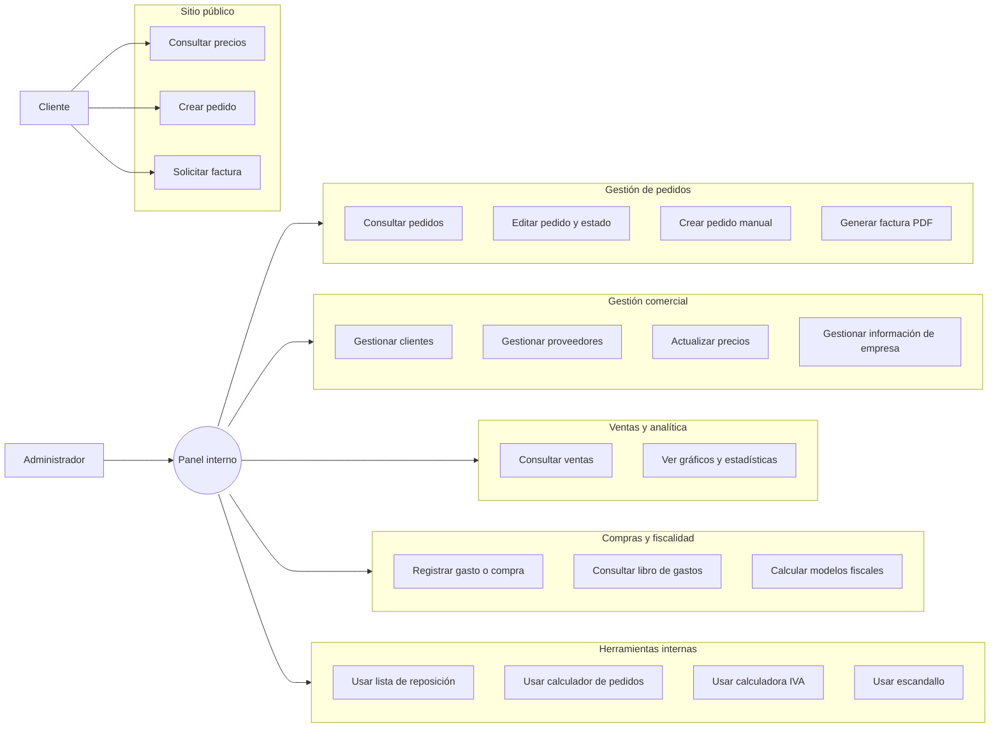

# App Churrería Guty

Aplicación modular de gestión empresarial para churrería compuesta de pequeñas aplicaciones  y herramientas interconectadas fruto de las necesidades reales de un negocio existente . Combina un ***formulario*** público de pedidos/presupuestos para los clientes  y  un panel privado de **administración** que cubre la gestión de **pedidos** y su configuracion como el cambio de precios, una base de datos de **clientes y proveedores**, pequeñas **herramientas** que van desde un calculador de materias primas y envases para los pedidos hasta un escandallo para saber el margen de beneficio o una lista de reposición, otras secciones son :  **ventas** , un histórico de cajas que sirve de información y estadística , **libro de gastos y compras** obligatorio para las pequeñas empresas y un apartado de **información** general de la empresa que se suele usar habitualmente.

La stack es deliberadamente simple y directa:

- Backend en Node.js + Express.
- Persistencia en MySQL mediante `mysql2/promise`.
- Frontend multipágina en HTML, CSS y JavaScript sin frameworks.
- Autenticación del panel mediante sesión de servidor.
- Tests con el runner nativo de Node y `supertest`.


## Qué hace la aplicación

La aplicación no es solo un formulario de pedidos. A día de hoy cubre varias áreas del negocio:

- Captación de pedidos desde la web pública con cálculo automático de presupuesto.
- Creación manual de pedidos desde administración con reglas distintas a las del formulario público.
- Gestión de pedidos activos e histórico de pedidos cobrados.
- Edición detallada del pedido, incluyendo estado, datos fiscales, descuento y datos de entrega.
- Generación/exportación de información operativa de pedidos y facturas.
- Gestión de clientes y proveedores con CRUD completo y exportación CSV.
- Mantenimiento centralizado de precios de churro, chocolate y envío para pedidos.
- Histórico de ventas pasadas en calendario y análisis gráfico agregado por años.
- Registro de compras y gastos con cálculos automáticos de IVA, retención y total de factura.
- Herramientas internas de apoyo: lista de reposición, calculador de pedidos, calculadora de IVA y escandallo.
- Información interna de empresa y páginas legales públicas.

## Diagrama de casos de uso



## Requisitos

- Node.js 18 o superior.
- MySQL Server 8.x.
- Opcional: MySQL Workbench o cualquier cliente SQL para inspección manual.

## Configuración

1. Crea la base de datos.
2. El servidor crea y ajusta el esquema al arrancar mediante `ensureSchema()`.
3. Si necesitas una referencia inicial, el repositorio incluye el dump `app_pedidos_guty.sql`.
4. Crea un archivo `.env` en la raíz con estas variables:

| Variable | Descripción | Valor por defecto |
|---|---|---|
| `PORT` | Puerto HTTP del servidor | `3000` |
| `DB_HOST` | Host de MySQL | `localhost` |
| `DB_PORT` | Puerto de MySQL | `3306` |
| `DB_USER` | Usuario de MySQL | `root` |
| `DB_PASS` | Contraseña de MySQL | vacío |
| `DB_NAME` | Nombre de la base de datos | `app_pedidos_guty` |
| `DB_SSL` | Si vale `true`, activa TLS para la conexión MySQL | vacío |
| `SESSION_SECRET` | Secreto para firmar la sesión de admin | `change-me` |
| `ADMIN_USER` | Usuario del panel de administración | `admin` |
| `ADMIN_PASS_HASH` | Hash bcrypt de la contraseña del admin | vacío |
| `NODE_ENV` | En `production` activa cookies `secure` y `trust proxy` | vacío |

Si `ADMIN_PASS_HASH` no está definido, el login usa la contraseña por defecto `admin123`. Eso es útil en local, pero no debería mantenerse en producción.

## Instalación y ejecución

```powershell
Push-Location "C:\Users\Guty\Desktop\AppChurreriaGuty"
npm install
npm start
```

Modo desarrollo con recarga automática:

```powershell
npm run dev
```

La aplicación queda disponible en `http://localhost:3000`.

## Despliegue y entornos

La conexión a base de datos siempre se resuelve desde `process.env.DB_*`. No hay credenciales hardcodeadas en el código.

- Local: usa tu `.env` con `DB_HOST=localhost` y deja `DB_SSL` vacío.
- Producción: configura las variables `DB_HOST`, `DB_PORT`, `DB_USER`, `DB_PASS` y `DB_NAME` en la plataforma de despliegue.
- TiDB Cloud u otros proveedores gestionados: añade `DB_SSL=true`.
- Despliegues detrás de proxy: con `NODE_ENV=production` el servidor activa `trust proxy` para que la cookie segura funcione correctamente bajo HTTPS.

## Arquitectura general

La aplicación está montada alrededor de un servidor Express único en `server.js`. Ese archivo concentra:

- Middlewares globales.
- Login/logout de administrador.
- Rutas HTML públicas y privadas.
- Endpoints JSON del panel.
- Validaciones de negocio y sanitización básica.
- Acceso a MySQL.
- Creación y actualización de esquema con `ensureSchema()`.
- Exportaciones CSV.

El frontend no usa SPA ni framework. Cada módulo importante tiene su propia página HTML con lógica embebida y estilos específicos, apoyándose en `public/styles.css` como hoja común.

## Módulos funcionales

### 1. Sitio público

- `public/index.html`: formulario de pedido con cálculo de presupuesto en tiempo real.
- `public/privacidad.html`: política de privacidad.
- `public/terminos.html`: términos y condiciones.
- `public/styles.css`: estilos compartidos para páginas públicas y privadas.

El formulario público consume `GET /api/precios` para calcular el presupuesto sin hardcodear precios en cliente.

**Objetivo** **y descripción**:

formulario para que los clientes del negocio puedan realizar un pedido introduciendo datos personales, datos de la factura,  cantidades, método de pago, envío y presupuesto para aceptar o rechazar al finalizar el formulario. Contempla múltiples restricciones y validaciones como un minimo de 100 € para realizar el pedido.


### 2. Autenticación y acceso al panel de administración

- `private/admin_login.html`: acceso al panel.
- `private/admin.html`: menú principal del área privada.
- Las rutas `/admin/*` usan sesión y `Cache-Control: no-store`.
- El login está protegido con limitación de intentos mediante `express-rate-limit`.


### 3. Gestión de pedidos

- `private/pedidos.html`: pedidos activos.
- `private/historial_pedidos.html`: histórico de pedidos cobrados.
- `private/admin_pedido.html`: edición detallada de un pedido concreto.
- `private/crear_pedido.html`: alta manual desde administración.


**Objetivo** **y descripción**:

Gestión de pedidos para el administrador de la empresa donde se muestra una lista de estos en tres vistas diferentes , tabla , fichas ( muy útil para la vista móvil) y calendario. Ordenados cronológicamente el usuario podrá ver de un vistazo los pedidos pendientes de hacer o pendientes de pago , podrá generar la factura de ese pedido en pdf , modificar el pedido o cambiarlo de estado , podrá crear un pedido en el caso que el cliente no quiera o no pueda rellenar el formulario , a la hora de crear el pedido puede seleccionar un cliente existente en la base de datos para asi autorellenar los campos y facilitar el proceso. Puede imprimir la lista en pdf y también incluye un historial de pedidos cobrados para su revisión o crear una copia de la factura.

Capacidades destacables:

- Búsqueda, filtros por texto/fecha/estado y paginación.
- Vistas adaptadas a escritorio y móvil.
- Exportación CSV.
- Impresión y generación de factura/PDF desde la vista de pedidos.
- Recalculo del total del pedido según cantidades, envío y descuento.
- Persistencia del precio usado en el pedido mediante snapshot para que facturas antiguas no cambien si se actualizan los precios globales.


### 4. Gestión comercial

- `private/clientes.html`: CRUD de clientes con exportación CSV.
- `private/proveedores.html`: CRUD de proveedores con exportación CSV.
- `private/informacion_empresa.html`: notas internas y datos operativos de empresa.

El alta pública de pedidos además alimenta la tabla de clientes mediante inserción o actualización por claves de negocio, para no perder trazabilidad del comprador.


### 5. Precios

- `private/precios.html`: edición de precios vigentes para los pedidos.
- Tabla `precios` con fila única `id = 1`.
- Los precios de churro, chocolate y envío siempre se leen desde base de datos.

Esto afecta tanto al formulario público como a las herramientas privadas que recalculan presupuestos.


### 6. Ventas y analítica

- `private/ventas.html`: calendario historico de caja diaria.
- `private/graficos.html`: gráficos históricos de ventas por año.
- `utils/graficosVentas.js`: lógica reutilizable para agregados y resúmenes anuales.
- `utils/temperaturasAemet.js`: temperaturas máximas diarias embebidas.
- `utils/precipitacionesAemet.js`: precipitaciones/categorías de lluvia embebidas.
- `utils/festivosEspana.js`: festivos y fechas especiales para enriquecer el calendario.

El módulo de ventas no solo muestra importes. También cruza la caja diaria con:

- temperatura máxima,
- lluvia por categorías,
- festivos nacionales y de Asturias,
- fechas especiales comerciales.

**Objetivo** **y descripción**:

Calendario histórico de cajas diarias pasadas sólo para información y estadísticas internas. El gráfico anual resume la caja por mes y muestra estadísticas como media anual y top 10 de días con más ventas, datos históricos muy importantes para planificar futuras campañas y fechas destacadas. La temperatura, el tiempo que hizo y los días festivos son muy importantes ya que están directamente relacionados con la caja en este negocio de ahí que se muestren, fueron obtenidos de datos oficiales de la AEMET.


### 7. Libro de gastos y compras

- `private/libro_gastos_compras.html`: consulta y gestión del libro.
- `private/crear_registro_libro.html`: alta de un registro de compra/gasto.

**Objetivo** **y descripción**:

Libro de registros de gastos y compras de la empresa , obligatorio según la agencia tributaria, crea registros de las facturas de compra y los divide en gastos comunes o gastos de inversión para finalmente mostrarlos en una tabla, también calcula los modelos 303 y 347 que se deben entregar a la agencia tributaria. 

Capacidades destacables:

- Registro de facturas de compra/gasto.
- Tipificación por categoría contable.
- Cálculo automático de IVA al 4%, 10% y 21%.
- Cálculo de retención y total de factura.
- Relación con proveedores por NIF/CIF.
- Alta automática de proveedor si aún no existe.
- Vista orientada a trabajo administrativo y explotación posterior.


### 8. Herramientas internas

- `private/herramientas.html`: entrada a utilidades.
- `private/lista_reposicion.html`: lista de reposición.
- `private/calculador_pedidos.html`: calculadora operativa de producción/preparación.
- `private/iva.html`: calculadora de IVA.
- `private/escandallo.html`: escandallo.
- `utils/calculadorPedidosLogic.js`: lógica pura del calculador, cubierta por tests.

**Objetivo** **y descripción**:

Sección compuestas de pequeñas herramientas útiles para el negocio , consta de una lista de reposición o de la compra, el trabajador puede ir rellenando un formulario que finalmente puede ser enviado por whatsapp al responsable de compras. También tiene una herramienta de escandallo que introduciendo el valor de las materias primas calcula el precio por unidad de venta, calculando así el margen de beneficio. Existe un calculador de IVA y un calculador de pedidos que introduciendo unos datos o seleccionando un pedido existente te calcula todo lo necesario para fabricar ese pedido.

El calculador de pedidos resuelve equivalencias operativas como bolsas, cajas, bidones, jarras, litros de chocolate, masa y tiempo estimado de preparación.


## Versión móvil o responsive. Dispositivos de pantalla reducida

La aplicación incluye una adaptación específica para móviles y dispositivos con pantalla reducida. Las vistas administrativas y de consulta ajustan su distribución para mejorar la lectura, simplificar la navegacion táctil y evitar tablas dificiles de usar en anchos pequeños.

En los apartados mas extensos, la interfaz cambia automaticamente de tablas a fichas o bloques verticales cuando el ancho de pantalla lo requiere. También se reorganizan botones, filtros y acciones para que sigan siendo accesibles desde teléfonos y tablets sin perder funcionalidad.

La experiencia móvil esta pensada para permitir consultas, edición de datos y gestión diaria desde dispositivos pequeños, manteniendo la misma lógica de negocio que en escritorio pero con una presentación mas cómoda y adaptada al tacto.

Se ha añadido una adaptación responsive mediante media queries en CSS para pantallas pequeñas, reorganizando la interfaz cuando el ancho del dispositivo es reducido.


## Reglas de negocio importantes

Estas son algunas reglas que conviene conocer antes de tocar código:

- El formulario público exige `nombre`, `telefono`, `fecha`, `hora` y `metodo_pago`.
- Si se solicita factura, `provincia` y `nif` pasan a ser obligatorios.
- El teléfono se normaliza eliminando prefijo `+34` y caracteres no numéricos.
- El NIF/NIE/CIF se valida y se guarda en mayúsculas.
- En pedidos públicos existe un presupuesto mínimo de 100 EUR.
- En el formulario público, el rango permitido de `churros_por_persona` es más restrictivo que en creación manual por admin.
- Los admins pueden aplicar descuentos al crear/editar pedidos; el cliente público no.
- El precio del pedido se guarda como snapshot (`precio_churro`, `precio_chocolate`, `precio_envio`) para preservar facturas históricas.
- Un pedido solo se puede borrar desde administración cuando su estado es `Cancelado`.
- La edición de precios afecta a nuevos cálculos, no reescribe retrospectivamente las facturas ya cerradas.

## Endpoints principales

### Salud y frontend público

- `GET /health`: comprobación simple de estado.
- `GET /api/precios`: devuelve precios vigentes para cálculo de presupuesto.
- `POST /api/pedidos`: crea un pedido público y devuelve `{ ok, id, presupuesto_total }`.

### Autenticación de administrador

- `POST /admin/login`
- `POST /admin/logout`

### Páginas privadas

- `GET /admin`
- `GET /admin/pedidos`
- `GET /admin/pedido`
- `GET /admin/pedido/:id`
- `GET /admin/historial-pedidos`
- `GET /admin/clientes`
- `GET /admin/proveedores`
- `GET /admin/precios`
- `GET /admin/informacion-empresa`
- `GET /admin/ventas`
- `GET /admin/ventas/graficos`
- `GET /admin/libro-gastos-compras`
- `GET /admin/crear-registro-libro`
- `GET /admin/crear-pedido`
- `GET /admin/herramientas`
- `GET /admin/herramientas/lista-reposicion`
- `GET /admin/herramientas/calculador-pedidos`
- `GET /admin/herramientas/iva`
- `GET /admin/herramientas/escandallo`

### API privada de administración

#### Pedidos

- `GET /admin/api/pedidos`
- `GET /admin/api/pedidos/:id`
- `PUT /admin/api/pedidos/:id`
- `DELETE /admin/api/pedidos/:id`
- `GET /admin/api/export.csv`

#### Clientes

- `GET /admin/api/clientes`
- `POST /admin/api/clientes`
- `PUT /admin/api/clientes/:id`
- `DELETE /admin/api/clientes/:id`
- `GET /admin/api/clientes/export.csv`

#### Proveedores

- `GET /admin/api/proveedores`
- `POST /admin/api/proveedores`
- `PUT /admin/api/proveedores/:id`
- `DELETE /admin/api/proveedores/:id`
- `GET /admin/api/proveedores/export.csv`

#### Precios

- `GET /admin/api/precios`
- `PUT /admin/api/precios`

#### Información de empresa

- `GET /admin/api/info-empresa`
- `POST /admin/api/info-empresa`
- `DELETE /admin/api/info-empresa/:id`

#### Ventas y datos de contexto

- `GET /admin/api/ventas`
- `GET /admin/api/tiempo`

#### Libro de gastos y compras

- `GET /admin/api/libro-gastos-compras`
- `POST /admin/api/libro-gastos-compras`
- `DELETE /admin/api/libro-gastos-compras/:id`

#### Assets privados servidos por el backend

- `GET /admin/assets/calculador-pedidos-logic.js`
- `GET /admin/assets/graficos-ventas.js`

## Ejemplos de uso de la API

Los siguientes ejemplos sirven como referencia rápida para integraciones, pruebas manuales o depuración local.

### 1. Comprobación de estado

```bash
curl http://localhost:3000/health
```

Respuesta esperada:

```json
{
	"ok": true
}
```

### 2. Consultar precios públicos

```bash
curl http://localhost:3000/api/precios
```

Respuesta típica:

```json
{
	"ok": true,
	"precios": {
		"churro": 1.2,
		"chocolate": 1.1,
		"envio": 3.5
	}
}
```

### 3. Crear un pedido público

```bash
curl -X POST http://localhost:3000/api/pedidos \
	-H "Content-Type: application/json" \
	-d '{
		"nombre": "Ana García",
		"telefono": "612345678",
		"email": "ana@ejemplo.com",
		"cp": "28001",
		"direccion": "Calle Mayor 1",
		"ciudad": "Madrid",
		"provincia": "Madrid",
		"nif": "12345678Z",
		"solicita_factura": false,
		"personas": 10,
		"churros_por_persona": 12,
		"chocolates": 0,
		"fecha": "2026-09-01",
		"hora": "18:00",
		"requiere_envio": false,
		"metodo_pago": "efectivo",
		"comentarios": "Sin comentarios",
		"descuento": 0
	}'
```

Respuesta típica:

```json
{
	"ok": true,
	"id": 123,
	"presupuesto_total": 144
}
```

### 4. Login de administrador

```bash
curl -i -X POST http://localhost:3000/admin/login \
	-H "Content-Type: application/json" \
	-c cookies.txt \
	-d '{
		"username": "admin",
		"password": "admin123"
	}'
```

Respuesta esperada:

```json
{
	"ok": true
}
```

### 5. Listar pedidos del panel

```bash
curl http://localhost:3000/admin/api/pedidos?page=1&pageSize=20 \
	-b cookies.txt
```

Respuesta típica:

```json
{
	"ok": true,
	"data": [
		{
			"id": 123,
			"nombre": "Ana García",
			"telefono": "612345678",
			"fecha": "2026-09-01",
			"hora": "18:00:00",
			"presupuesto_total": "144.00",
			"estado": "Pendiente"
		}
	]
}
```

### 6. Actualizar precios desde administración

```bash
curl -X PUT http://localhost:3000/admin/api/precios \
	-H "Content-Type: application/json" \
	-b cookies.txt \
	-d '{
		"churro": 1.3,
		"chocolate": 1.2,
		"envio": 4.0
	}'
```

Respuesta típica:

```json
{
	"ok": true,
	"precios": {
		"churro": 1.3,
		"chocolate": 1.2,
		"envio": 4
	}
}
```

### 7. Crear un cliente desde administración

```bash
curl -X POST http://localhost:3000/admin/api/clientes \
	-H "Content-Type: application/json" \
	-b cookies.txt \
	-d '{
		"nif": "12345678Z",
		"nombre": "María López",
		"telefono": "612345678",
		"email": "maria@ejemplo.com",
		"direccion": "Avenida 2",
		"ciudad": "Sevilla",
		"provincia": "Sevilla",
		"cp": "41001"
	}'
```

### 8. Registrar un gasto o compra

```bash
curl -X POST http://localhost:3000/admin/api/libro-gastos-compras \
	-H "Content-Type: application/json" \
	-b cookies.txt \
	-d '{
		"fecha_factura": "2026-10-01",
		"proveedor_nombre": "Proveedor Central SL",
		"nif_cif": "B12345678",
		"numero_factura": "FC-2026-001",
		"tipo_compra_gasto": "Compras y servicios",
		"base_4": 0,
		"base_10": 100,
		"base_21": 50,
		"base_0": 0,
		"ret_percent": 0
	}'
```

Este endpoint calcula en servidor el IVA por tramo, la retención y el total de factura antes de guardar el registro.

## Base de datos

El repositorio incluye `app_pedidos_guty.sql` como referencia, pero el servidor también mantiene el esquema al arrancar. A nivel funcional, las tablas principales giran alrededor de:

- `pedidos`
- `clientes`
- `proveedores`
- `precios`
- `ventas`
- `libro_compras_gastos`
- `info_empresa`

La aplicación está pensada para preservar historial y consistencia de negocio más que para ser un simple CRUD aislado por tablas.

## Estructura del proyecto

```text
.
|-- server.js
|-- package.json
|-- app_pedidos_guty.sql
|-- public/
|   |-- index.html
|   |-- privacidad.html
|   |-- terminos.html
|   `-- styles.css
|-- private/
|   |-- admin.html
|   |-- admin_login.html
|   |-- pedidos.html
|   |-- historial_pedidos.html
|   |-- admin_pedido.html
|   |-- crear_pedido.html
|   |-- clientes.html
|   |-- proveedores.html
|   |-- precios.html
|   |-- ventas.html
|   |-- graficos.html
|   |-- libro_gastos_compras.html
|   |-- crear_registro_libro.html
|   |-- informacion_empresa.html
|   |-- herramientas.html
|   |-- lista_reposicion.html
|   |-- calculador_pedidos.html
|   |-- iva.html
|   `-- escandallo.html
|-- utils/
|   |-- calculadorPedidosLogic.js
|   |-- clientePicker.js
|   |-- validations.js
|   |-- graficosVentas.js
|   |-- temperaturasAemet.js
|   |-- precipitacionesAemet.js
|   `-- festivosEspana.js
|-- test/
|   |-- calculadorPedidos.test.js
|   |-- clientePicker.test.js
|   |-- graficosVentas.test.js
|   |-- integration.test.js
|   `-- validations.test.js
`-- img/
```

## Dependencias principales

Producción:

- `express`
- `mysql2`
- `dotenv`
- `express-session`
- `bcryptjs`
- `helmet`
- `express-rate-limit`

Desarrollo y test:

- `nodemon`
- `supertest`

## Tests

Ejecutar toda la suite:

```powershell
npm test
```

La suite actual cubre varias piezas importantes:

- `test/validations.test.js`: validaciones de teléfono, email, NIF/NIE/CIF y payload de pedido.
- `test/clientePicker.test.js`: reutilización del último pedido del cliente y rellenado del formulario.
- `test/calculadorPedidos.test.js`: lógica del calculador operativo de pedidos.
- `test/graficosVentas.test.js`: agregados y resúmenes anuales del módulo de gráficos.
- `test/integration.test.js`: endpoints clave, autenticación, CRUD de clientes/proveedores, pedidos, paginación, restricciones de borrado y acceso al módulo de gráficos.

## Seguridad

- Autenticación de admin con sesión de servidor (`express-session`).
- Contraseña de admin validada con `bcryptjs` cuando se usa `ADMIN_PASS_HASH`.
- Limitación de intentos de login mediante `express-rate-limit`.
- Cookies `secure` en producción.
- `helmet` activado, con CSP deshabilitada porque las vistas usan scripts y estilos inline.
- Cabecera `Cache-Control: no-store` para todo el panel admin.
- Validaciones server-side para datos críticos de negocio.

## Limitaciones y notas técnicas

- `server.js` concentra toda la lógica HTTP y de acceso a datos; es una decisión consciente del proyecto en su estado actual.
- Gran parte del frontend usa scripts inline dentro de cada HTML privado.
- Los datos meteorológicos y festivos se sirven desde constantes del repositorio, no desde base de datos ni APIs externas en runtime.
- El sistema está muy orientado a una operación concreta de negocio; antes de generalizarlo conviene revisar dependencias entre vistas y reglas de cálculo.

## Troubleshooting

- Si el servidor no arranca, revisa `DB_HOST`, `DB_PORT`, `DB_USER`, `DB_PASS` y `DB_NAME`.
- Si usas TiDB Cloud o un proveedor con TLS obligatorio, activa `DB_SSL=true`.
- Si el puerto `3000` está ocupado, cambia `PORT`.
- Si el login de admin falla, revisa `ADMIN_USER` y `ADMIN_PASS_HASH`.
- Si no definiste `ADMIN_PASS_HASH`, el acceso por defecto es `admin` / `admin123`.
- Si faltan precios en la tabla `precios`, los formularios y recálculos no podrán funcionar correctamente.
